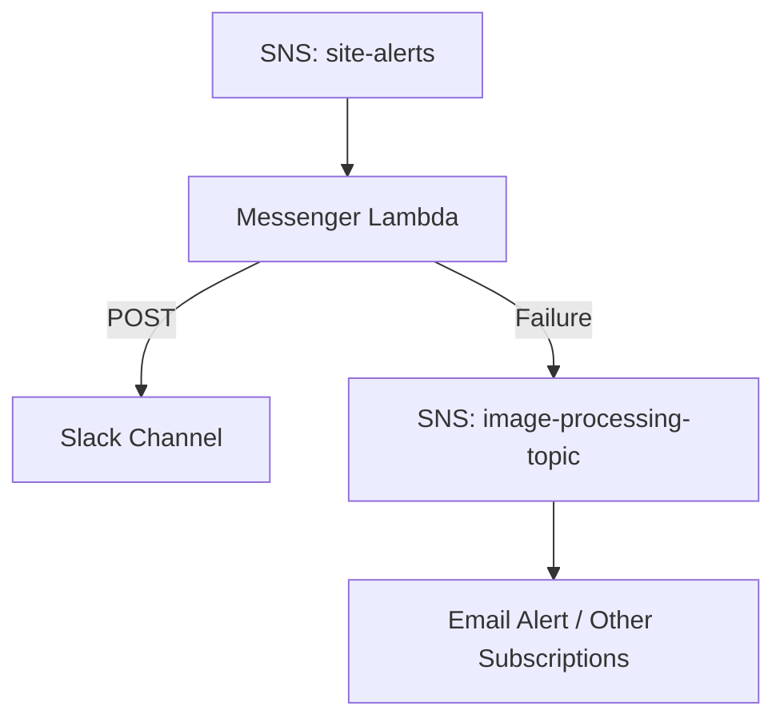

# Vectoplus Messenger Lambda

This Lambda function receives SNS events and posts formatted messages to specific Slack channels based on payload data. If Slack delivery fails (e.g. webhook misconfiguration, network error), the function **falls back** to publishing a new message to a secondary SNS topic, triggering an **email alert** or any other subscribed handler.

---

## Features

* 🧵 Routes Slack messages by `channel` (e.g., #general, #site-errors)
* 🔁 Supports emoji in messages
* 🔥 Graceful fallback via SNS (no direct use of nodemailer)
* ✅ Modular Slack webhook configuration via environment variables
* 📦 Packaged using CDK with zipped Lambda and Layer

---

## Slack Channels Supported

These are configured using environment variables:

* `SLACK_MESSAGES_GENERAL`
* `SLACK_MESSAGES_ERRORS`
* `SLACK_MESSAGES_UPLOAD`
* `SLACK_MESSAGES_TRANSACTIONS`
* `SLACK_MESSAGES_CONTRIBUTOR_SIGNUP`
* `SLACK_MESSAGES_SIGNUPS`

---

## Fallback Topic

If a Slack message fails, a message is sent to this SNS topic:

```
arn:aws:sns:us-east-1:511873596089:image-processing-topic
```

You can attach an email subscriber or other destination.

---

## Deployment Overview

* Code is zipped with a hash check to avoid unnecessary redeploys
* AWS CDK deploys:

  * `vectoplus-messenger` Lambda
  * `vectopus-messenger-layer` for `@aws-sdk/client-sns`
  * SNS topic for Slack messages: `site-alerts`
  * Permissions for publishing to the fallback topic

---

## Architecture Diagram



---

## Local Testing

Use `local-test.js` to:

* Test local Lambda function directly
* Send simulated Slack failure to verify fallback SNS trigger
* Send messages to the \*de
